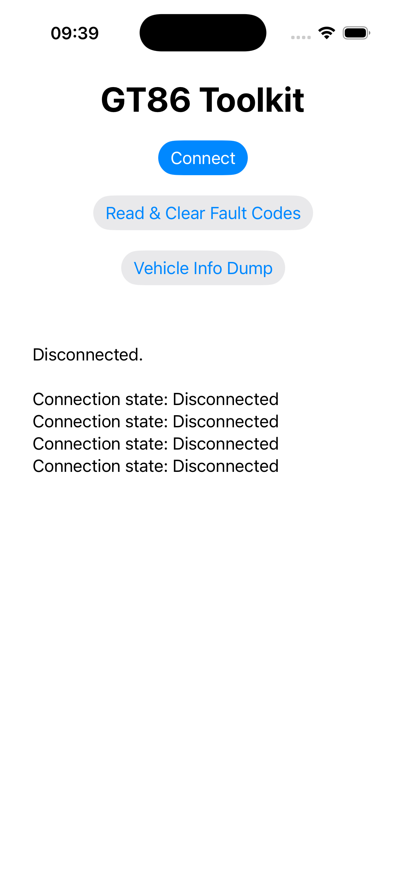
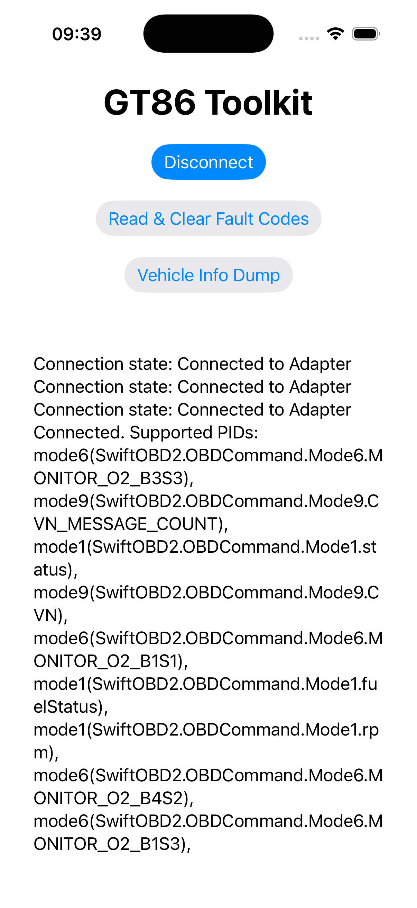
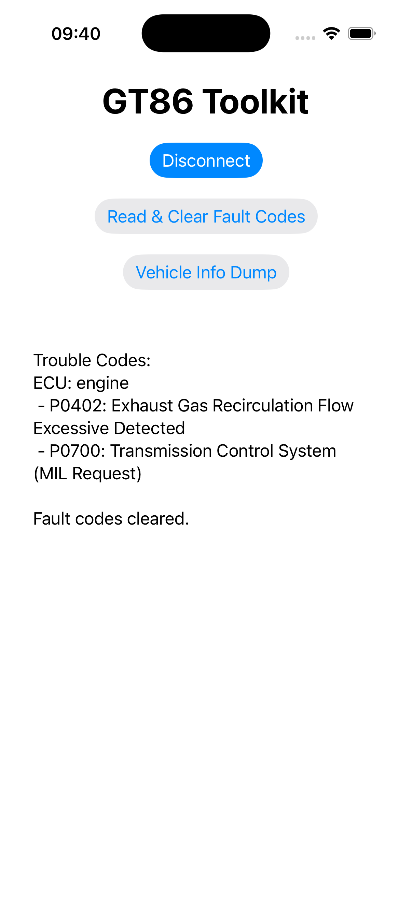
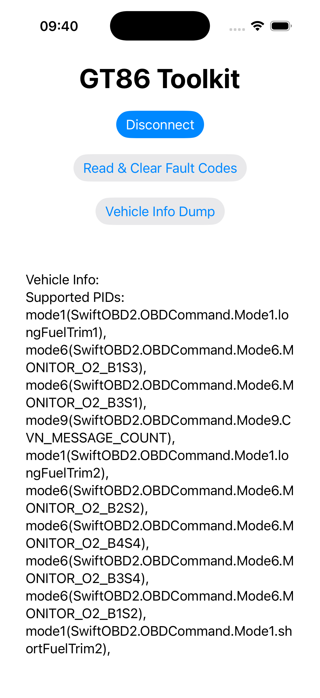

# GT86 Toolkit

GT86 Toolkit lets you communicate with Toyota GT86 via BLE adapter. It allows connection to the OBD2 system to: read and clear fault codes, and retrieve vehicle information such as supported PIDs. This app only supports iOS as it is built on Swift.

## Features

- 🔌 Connect/Disconnect to the vehicle's OBD2 adapter via Bluetooth
- 🛠 Read and clear diagnostic trouble codes (fault codes)
- 📋 Dump vehicle information including supported PIDs

## Screenshots

|||
|---|---|
|||